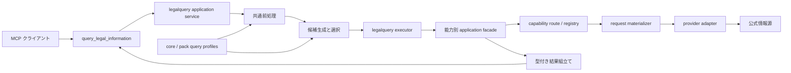

# SOT-ARCH-022: 統合照会の計画パイプライン

- 状態: 有効

## 規定

統合法情報照会は、公開 MCP 境界から情報源へ直接分岐せず、入力検証、共通前処理、意味候補生成、候補選択、既存ユースケース実行および公開結果組立てを順に進める単方向パイプラインとして構成する。

## 構造

## レイヤの責務

| レイヤ | 責務 | 持ってはならないもの |
|---|---|---|
| MCP ツール | JSON schema による入力検証、context の受渡し、公開モデルへの変換 | 意図 score、provider 選択、外部 DTO |
| `application/legalquery` | request 全体の予算、候補計画、選択、logical step の実行、部分失敗と結果順序 | MCP JSON、外部 API、HTML selector |
| 共通前処理 | Unicode 比較用正規化、Kagome、辞書照合、構造化参照、誤記候補の一意性 | capability の採否、provider ID |
| query profile | 採用済み task/resource、根拠、重み、閾値、辞書と plan 生成規則 | transport、ネットワーク状態、利用者ごとの学習状態 |
| 能力別 application facade | logical input、route、item 予算および任意の `ref` から既存ユースケースを呼ぶ | 意味 score、公開 MCP schema |
| registry | `(providerId, capabilityId, majorVersion)` binding と primary route | 意味分類、pack の製品判断 |
| request materializer | 選択済み binding に対する既存 capability request の決定的な組立て | 候補順位、fallback、外部呼出し |
| provider adapter | 外部仕様、DTO、parser、mapping、情報源エラー | Kagome、法令名辞書、法概念辞書、他 provider |

MCP handler は `SOT-ARCH-006` に従い薄く保つ。統合照会の planner は provider capability ではなくアプリケーションサービスとし、`ProviderCapability` registry へ `legal-query.plan` のような擬似能力を登録しない。

## 依存方向

`application/legalquery` が所有する interface を、共通前処理、query profile および能力別 application facade が実装する。composition root は、法令コア profile、有効な拡張パックの profile、能力別 facade、route、request materializer および予算を起動時に検証して注入する。

`application/legalquery` と query profile は `internal/source/...` を import しない。provider package は `application/legalquery`、query profile、Kagome または辞書 package を import しない。provider の選択は既存ユースケースの先にある registry だけが行う。

planner は `SourceResourceRef` を生成しない。入力で受け取った `ref` は共通モデルの不透明な exact target として保持できるが、provider と resource の照合は能力別 facade と registry が行う。法令 ID から provider を含む read request を作る処理も、route 選択後の request materializer が行う。

request materializer は provider DTO を返さず、既存 capability SOT が定める request 型だけを返す。裁判例の事件番号、題名または URL を canonical `ref` へ推測変換する resolver は初期版に設けない。

各段階は入力を変更せず新しい値を返す。辞書、profile、tokenizer、registry および route は起動後に変更せず、照会間で候補、入力、結果または学習状態を保持しない。

## 既存専門ツール

既存の専門 MCP ツールは、この planner を通さず対応する既存ユースケースへ直接到達する。統合照会を追加しても、専門ツールの入力解釈、pagination、provider 固有 facade またはエラー契約を変更しない。

統合照会は専門 MCP ツールを MCP 経由で再呼出しせず、その背後にある型付きユースケースを能力別 application facade から in-process で利用する。

## 禁止する形

- LLM、外部分類 API または利用者別履歴で候補を決めること
- MCP handler、planner または profile が provider package を直接選択すること
- provider adapter が別 provider、planner、辞書または MCP tool を呼び出すこと
- e-Gov の query parameter、裁判所 HTML selector または provider DTO を共通 candidate へ格納すること
- 専門ツールの公開 JSON を内部ユースケース間の契約として再利用すること
- 検索結果、事件番号または URL から provider 固有の `SourceResourceRef` を planner が推測すること

## 確認

静的依存検査で上記 import 境界を確認する。fake の前処理、profile、能力別 facade、materializer および route を差し替え、MCP transport とネットワークなしで planner と executor を単体テストできることを確認する。

法令 ID と検証済み `ref` の request materialization、`ref` 不一致の外部呼出し前拒否、既存専門ツールが planner なしで起動できること、および統合照会が専門ツールの MCP handler を呼び出さないことをアーキテクチャテストで確認する。

## 関連

- [SOT-ARCH-006: MCP ツール境界](06-mcp-tool-boundary.md)
- [SOT-ARCH-007: 依存方向](07-dependency-direction.md)
- [SOT-ARCH-010: プロバイダーの分離](10-provider-isolation.md)
- [SOT-ARCH-012: プロバイダーの登録](12-provider-registry.md)
- [SOT-ARCH-020: 採用済みユースケース境界](20-adopted-use-case-boundary.md)
- [SOT-ARCH-021: プロバイダー非依存の検索語前処理](21-provider-independent-query-preprocessing.md)
- [SOT-MODEL-023: LegalQueryPlan](../20-model/23-legal-query-plan.md)
- [SOT-ENG-025: 統合照会のパッケージ構成](../50-engineering/25-unified-query-package-layout.md)
