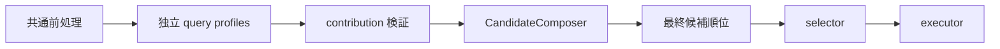

# SOT-ARCH-027: 統合照会の profile 横断候補合成

- 状態: 有効

## 規定

統合照会は、一つの照会文で異なる能力群の取得をそれぞれ明示した場合、
各 query profile が独立に生成した必須構成員を、selector より前に一つの
`LegalQueryCandidate` へ決定的に合成する。

合成は `application/legalquery` が所有する provider 非依存の
`CandidateComposer` が行う。core profile と pack profile は互いを import
せず、自身の候補と `SOT-MODEL-028` の composition member だけを生成する。

## パイプライン上の位置

composer は全 profile contribution の検証後、最終候補の安定順位を確定する
前に一回だけ動作する。selector、executor、能力別 facade または provider
adapter は候補を合成しない。

## 合成対象

composer は composition root の固定 profile 順で
`role=required_member` を収集する。二つ以上の異なる profile から、一意な
member を各一件ずつ得た場合だけ合成する。

次のいずれかに該当する contribution は、候補を推測で結合しない。

- member が一 profile だけにある
- 一つの profile が複数の member または代替候補を出した
- contribution が `clarification_required` である
- member 候補が hedge pair に属する
- step origin が不足または不正である
- 明示 task/resource の対応を profile が一意に確定できない

これらは contribution 自体の構造違反ではなく、合成適格性を満たさない状態と
して扱う。composer は当該 contribution だけを収集対象から除外し、ほかの
二つ以上の profile から一意な member を得られる場合は、その member 間の
合成を継続する。除外した contribution の構成元候補は変更せず、通常の
意味順位へ残す。

`clarification_required` contribution を除外した場合は、profile set の
`selectionMode=clarification_required` が照会全体の実行を引き続き禁止する。
一方、`automatic` contribution が member の複数性、代替候補の併存または
不正な原文位置によって除外された場合は、profile set 内部だけの
`composition_ineligible` 制約を立てる。selector は対象外信号を先に適用した
後、通常の score 選択と pack 可否より前にこの制約を
`needs_clarification` と `ambiguous_candidates` へ変換し、候補を選択せず
外部情報源を呼ばない。`composition_ineligible` は query profile が
`QueryProfileContribution` に出力できる値ではなく、公開 MCP 結果にも
出さない。

automatic contribution の明示候補が複数ある場合、または member 候補が
hedge pair に属する場合も、profile は各候補の有効な原文位置 sidecar を
早期に捨てない。composer は候補、member および hedge pair をまとめて見て
profile 横断合成を検討する際に当該 contribution を除外し、
`composition_ineligible` を立てる。弱い一般語、
位置を決められない step または `clarification_required` 候補について、
profile が member を捏造してはならない。

`composition_ineligible` は、二つ以上の異なる profile が automatic member
を出し、profile 横断合成を検討する場合にだけ立てる。一つの profile だけが
member を持つ照会では、その profile 内の通常の single または hedge 選択を
変更しない。member を持たない non-member 候補が別 profile にあることだけを
理由に、合成不適格へ変換してはならない。

照会文の byte 範囲外または UTF-8 rune の途中を指す
`sourceStartByte` も、合成適格性を満たさない位置として同様に扱う。
負数、未知 ID、重複 ID または candidate と step の対応不一致は
`SOT-MODEL-028` の構造違反として contribution 構築時に拒否する。

代替解釈を合成すること、上位 score の core 候補と pack 候補を無条件に
組み合わせること、および照会文全体を広い検索語として補うことを禁止する。

## step 順序と ID

全構成元 step は、次の完全順で新しい配列へ並べる。

1. `sourceStartByte` の昇順
2. 同じ位置では composition root の profile 順
3. 同じ profile では元候補の step 順

composer は構成元の candidate ID と step ID を再利用しない。profile 数の
次の ordinal を composer 専用 `CandidateIDScope` とし、合成候補と全 step
へ入力断片を含まない新しい ID を割り当てる。

合成候補の意味署名は、昇順に正規化した `requiredPacks` と、上記の順序に
並べた provider 非依存 logical input から作る。score、evidence、profile ID、
source position または構成元 ID を意味署名へ入れない。

## 根拠、score、概念および pack

合成候補は次の値を持つ。

- `evidenceCodes`: 構成元候補が検証済みの根拠を和集合にし、
  `SOT-MODEL-022` の強い順へ重複なく並べた値
- `semanticScore`: 構成元 score の加算、平均または最大値ではなく、
  根拠の和集合を共通 `QueryScorePolicy` で一回だけ再計算した値
- `confidence`: 再計算した score を同じ共通 policy へ適用した値
- `conceptSources`: `{conceptId,title,url,confirmedOn}` の完全一致だけを同一要素と
  みなす和集合。順序は `conceptId` の昇順とし、同じ `conceptId` で内容が
  異なれば失敗
- `requiredPacks`: 全構成元の和集合を pack ID の昇順にした値

各 profile が同じ意味内で既に正規化した根拠を、別 profile の根拠だけを
理由に削除しない。composer は profile 固有の根拠優先規則を再実装せず、
検証済みの構成元 evidence を和集合にする。

合成に成功した member 候補は、全照会の一部分にすぎないため最終候補集合
から除き、完成した合成候補へ置き換える。

member ではない候補は、logical input と pack が合成候補の proper subset
であっても除かない。non-member は step の原文位置を証明する sidecar を
持たず、同じ明示意図の重複部分か、別の位置で個別に要求された意図かを
composer が判定できないためである。位置の同一性を証明する別の採用済み
モデルがない限り、意味署名だけによる non-member の削除を禁止する。
合成から除外した contribution では member を含む元候補をすべて保持する。

## 上限と非実行

合成後の step は一件以上四件以下とする。必須 member の step 合計が五件
以上の場合は切り捨てず、member 候補だけを部分実行せず、外部情報源を
呼ばない `needs_clarification` へ渡す。

`step_limit_exceeded` と `composition_ineligible` を同時に検出した場合は、
より具体的な `step_limit_exceeded` を profile set result に保持する。

合成後の全候補数にも十六件上限を適用する。上限超過を切り捨て、profile
順または score 順の一部だけを残してはならない。

pack の有効状態は合成に影響しない。同じ照会文、profile set および
composition version では、pack の有効・無効にかかわらず同じ合成候補、
step 順、意味署名および `requiredPacks` を作る。必要な pack が無効なら、
selector は合成候補全体を `capability_unavailable` とし、pack を必要と
しない step も部分実行しない。

## version

composer は不透明な `compositionVersion` を持つ。member の採用条件、
step の完全順、根拠の統合、構成元の消費規則または上限処理を変更した場合は
version を変更する。

active profile set の不透明な `profileVersion` は、固定順の profile metadata
に加えて `compositionVersion` と実際の合成規則を含む決定的な入力から作る。
合成規則が変われば、各 profile の data が同じでも別の profile set version
とする。score scale、confidence、閾値または最終 tie-break を変更する場合は
`rankingVersion` も変更する。

## 例

`民法を検索し、裁判例を「工場騒音」で検索してください`は、原文順の
`law_search("民法")` と `judicial_decision_search("工場騒音")` を持つ
一候補とし、`requiredPacks=["judicial-cases"]` とする。

`この裁判例参照を読み、成年後見の条文と裁判例も検索してください`は、
検証済み `ref` の `judicial_decision_read`、`law_content_search`、
`judicial_decision_search` を原文順に持つ一候補とする。

`裁判例を「駅構内転倒」で検索し、この参照を読んでください`は、検索語を
ref 読取りの説明語として捨てず、`judicial_decision_search` と
`judicial_decision_read` を原文順に持つ一候補とする。

`永住権について法情報を調べてください`のように resource を一意に指定
しない概念候補は合成せず、法令条文と裁判例の代替解釈として明確化する。

`営業秘密と個人情報を両方含む条文を検索してください`は profile 横断合成
ではなく、`allTerms` を二語持つ一つの `law_content_search` とする。

## 確認

二・三・四 step の合成、元の profile 順と異なる原文順、同一位置の
tie-break、新しい ID、根拠・概念・pack の和集合、score と confidence の
再計算、構成元 member 候補の除去、proper subset であっても
non-member 候補を保持すること、一つの不適格または明確化 profile を除いて
残る二 profile を合成すること、および決定性を単体テストする。

pack 有効時の `single`、無効時の同一意味による
`capability_unavailable`、外部呼出し零回、五 step の明確化、曖昧な概念、
hedge、弱い一般語、重複 member、不正位置の非実行、
non-member proper subset の保持、裁判例 `ref` の検索後読取りで検索語と
原文順を保持すること、および異なる概念資料の衝突を
統合テストする。

core と `judicial-cases` の混合 fixture、裁判例 `ref` の read と検索、
四 collection step の item 予算、および公開結果の plan 順を
`SOT-ENG-024` の評価で確認する。

## 関連

- [SOT-MODEL-022: LegalQueryCandidate](../20-model/22-legal-query-candidate.md)
- [SOT-MODEL-023: LegalQueryPlan](../20-model/23-legal-query-plan.md)
- [SOT-MODEL-026: QueryProfileContribution](../20-model/26-query-profile-contribution.md)
- [SOT-MODEL-028: QueryCandidateCompositionMember](../20-model/28-query-candidate-composition-member.md)
- [SOT-ARCH-022: 統合照会の計画パイプライン](22-unified-query-planning-pipeline.md)
- [SOT-ARCH-023: 統合照会の候補選択と制限付き実行](23-unified-query-selection-and-hedging.md)
- [SOT-ARCH-025: 統合照会の複数主題分離](25-unified-query-multi-topic-separation.md)
- [SOT-ENG-024: 統合照会の評価コーパスと受入基準](../50-engineering/24-unified-query-evaluation-gate.md)
